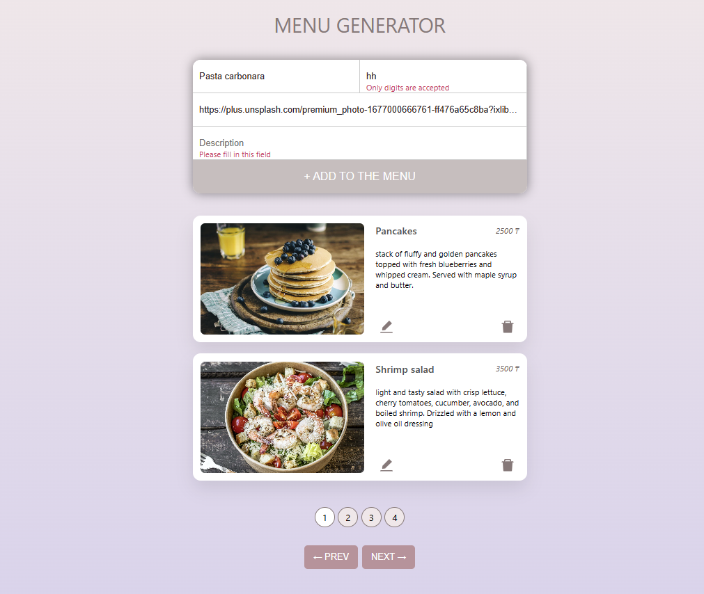
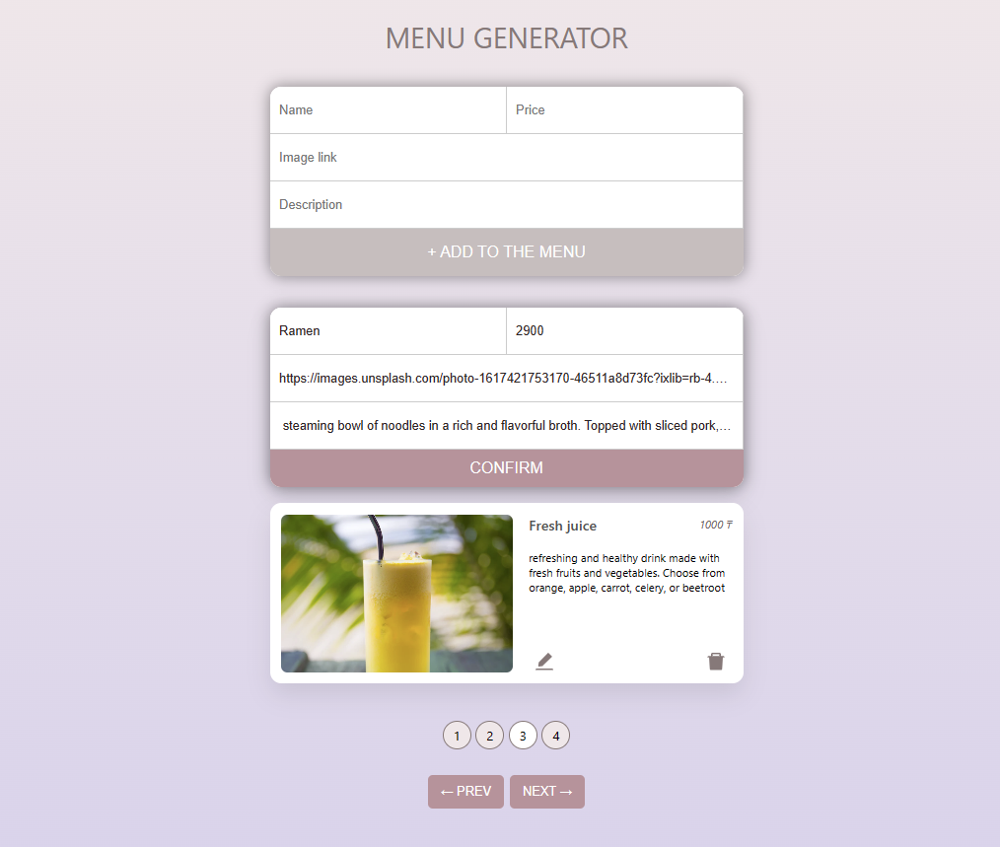

# Menu Generator Application

This project is a practice of using TypeScript with React.

## Features

- Custom hook for form validation
- Ability to edit and delete dishes on cards
- Cards are stored in the local storage

## Screenshots

## Installation Guide

# Clone the repository

`git clone git@github.com:julbrn/menu-generator.git`

# Install the dependenies

`npm install`

# Run the application locaaly on port 3000

`npm start`
